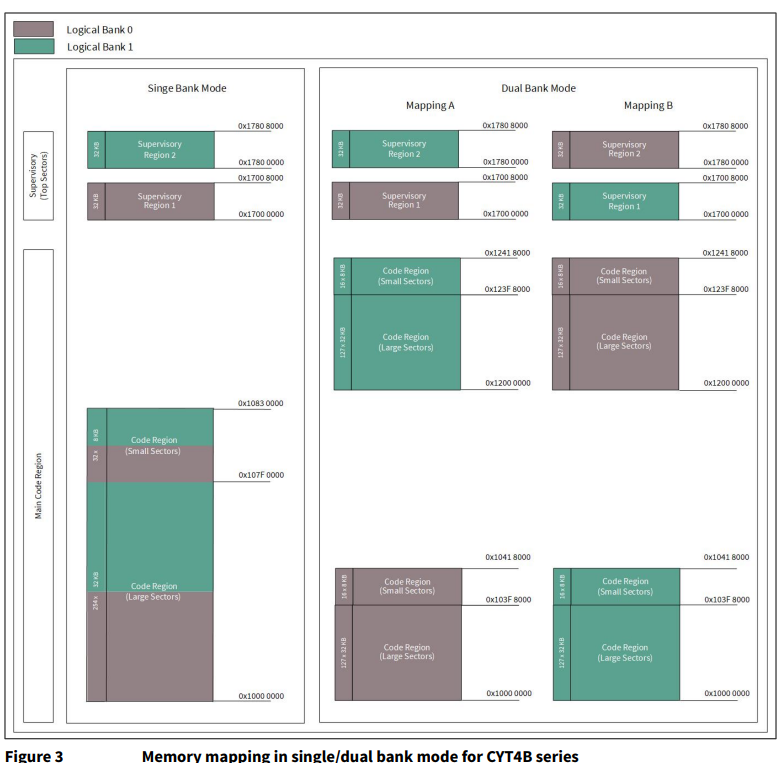

# Emulated EEPROM Library - Non-Volatile Storage with Wear Leveling for ModusToolbox

## Overview
The Emulated EEPROM middleware emulates an EEPROM device in the device's non-volatile memory.
The middleware operates on top of the block-storage library that abstracts the underlying memory architecture by specifying how to perform read, write, and erase operations, and provides auxiliary functions to retrieve erase and program sizes and to verify that an address is within the memory range.

Use the Emulated EEPROM to store non-volatile data on a target device, with optional wear leveling
and the ability to restore corrupted data from a redundant copy.

## Features
* EEPROM-Like Non-Volatile Storage - access flash memory through a familiar EEPROM-style API
* Easy-to-use Read and Write API
* Optional Wear Leveling - distributes writes evenly to extend flash endurance (factor 1-10)
* Optional Redundant Data Storage - maintains a backup copy with checksum validation for data recovery
* Supports any block-storage-compatible memory, including internal NVM and external flash (e.g. via QSPI)
* Resilient to power failures

## When to Use
Use the Emulated EEPROM middleware when your application needs to:
* Store small amounts of non-volatile configuration or calibration data in flash memory without a
  dedicated EEPROM device.
* Increase flash write endurance beyond the raw hardware specification by enabling wear leveling.
* Protect against data corruption caused by unexpected power loss or bit errors, using the redundant
  copy feature with checksum verification.
* Retain a familiar EEPROM-style API (Read, Write, Erase) while targeting MCUs that expose only
  raw NVM or block-storage interfaces.
* Support external flash storage (e.g. QSPI) through the block-storage abstraction layer.

Do **not** use this middleware when the application requires large-scale file storage or a filesystem — consider a dedicated flash file system instead, such as [emFile](https://github.com/Infineon/emfile) or [littlefs](https://github.com/Infineon/mtb-littlefs), both available as ModusToolbox middleware.

## How to Use

The steps below describe the most common setup: Em_EEPROM data placed in the application flash with wear leveling enabled. For other storage locations (auxiliary flash, fixed address, Work Flash on XMC7xxx/T2G-B-H), refer to the API Reference.

**Step 1 - Open or create an application.**
Open an existing ModusToolbox application or create a new one into which you want to add Em_EEPROM
functionality.

**Step 2 - Add the Em_EEPROM middleware to the project.**
In the ModusToolbox IDE, select the application in **Project Explorer**, then open
**Project > ModusToolbox Library Manager**, check **Emulated EEPROM**, and click **OK**.
Alternatively, add `emeeprom` as a dependency in your `deps/` folder.

**Step 3 - Include the Em_EEPROM header.**
```c
#include "cy_em_eeprom.h"
```

**Step 4 - Define the Em_EEPROM configuration macros.**
```c
/* The size of data to store in EEPROM */
#define DATA_SIZE        (CY_FLASH_SIZEOF_ROW)

/* The Simple Mode is turned off */
#define SIMPLE_MODE      (0u)

/* Increases the flash endurance twice */
#define WEAR_LEVELING    (2u)

/* The Redundant Copy is turned off */
#define REDUNDANT_COPY   (0u)

/* The Blocking Write is turned on */
#define BLOCKING_WRITE   (1u)
```
Refer to the `cy_stc_eeprom_config2_t` structure for details of all configuration options.

**Step 5 - Declare the Em_EEPROM storage array in NVM.**
```c
CY_ALIGN(CY_EM_EEPROM_FLASH_SIZEOF_ROW)
const uint8_t emEepromStorage[CY_EM_EEPROM_GET_PHYSICAL_SIZE(DATA_SIZE, SIMPLE_MODE,
                                          WEAR_LEVELING, REDUNDANT_COPY)] = {0u};
```
The array must be zero-initialized and aligned to `CY_EM_EEPROM_FLASH_SIZEOF_ROW`.

**Step 6 - Allocate the Em_EEPROM context structure.**
```c
cy_stc_eeprom_context_t eepromContext;
```

**Step 7 - Populate the Em_EEPROM configuration structure.**

```c
cy_stc_eeprom_config2_t eepromConfig =
{
    .eepromSize         = DATA_SIZE,
    .simpleMode         = SIMPLE_MODE,
    .wearLevelingFactor = WEAR_LEVELING,
    .redundantCopy      = REDUNDANT_COPY,
    .blockingWrite      = BLOCKING_WRITE,
    .userNvmStartAddr   = (uint32_t)&(emEepromStorage[0u]),
};
```

**Step 8 - Initialize the middleware once at startup.**

For devices using the HAL NVM block-storage backend:
```c
mtb_block_storage_t my_bsd;
cy_rslt_t result;
if (CY_RSLT_SUCCESS == mtb_block_storage_nvm_create(&my_bsd))
{
    result = Cy_Em_EEPROM_Init_BD(&eepromConfig, &eepromContext, &my_bsd);
    if (CY_RSLT_SUCCESS != result)
    {
        printf("Em_EEPROM init failed: 0x%08lx\r\n", (unsigned long)result);
    }
}
```

PSOC™ 4, PMG1 (CAT2) and CCGxF_CFP family of devices (CAT2 PDL block-storage backend):
```c
mtb_block_storage_t my_bsd;
cy_rslt_t result;
if (CY_RSLT_SUCCESS == mtb_block_storage_cat2_create(&my_bsd))
{
    result = Cy_Em_EEPROM_Init_BD(&eepromConfig, &eepromContext, &my_bsd);
    if (CY_RSLT_SUCCESS != result)
    {
        printf("Em_EEPROM init failed: 0x%08lx\r\n", (unsigned long)result);
    }
}
```
The init function stores the configuration and current state of EEPROM storage in the context.
It is used and updated by all subsequent API calls.

**Note:** The example code uses `printf()` for diagnostic output, which requires the
[retarget-io](https://github.com/Infineon/retarget-io) middleware. Either start from a
ModusToolbox project that already includes retarget-io (for example, the **Hello World**
code example), or add it to your project via **Project > ModusToolbox Library Manager**.
If you prefer not to use retarget-io, replace the `printf()` calls with another error
handler appropriate for your application — for example `CY_ASSERT(0)` to halt in debug
builds, or a dedicated error-reporting routine.

**Step 9 - Read, write, and erase data.**
```c
uint8_t readData = 0xAAu;
cy_rslt_t result;

result = Cy_Em_EEPROM_Write(0u, &readData, 1u, &eepromContext);
if (CY_RSLT_SUCCESS != result)
{
    printf("Em_EEPROM write failed: 0x%08lx\r\n", (unsigned long)result);
}
result = Cy_Em_EEPROM_Read(0u, &readData, 1u, &eepromContext);
if (CY_RSLT_SUCCESS != result)
{
    printf("Em_EEPROM read failed: 0x%08lx\r\n", (unsigned long)result);
}
result = Cy_Em_EEPROM_Erase(&eepromContext);
if (CY_RSLT_SUCCESS != result)
{
    printf("Em_EEPROM erase failed: 0x%08lx\r\n", (unsigned long)result);
}
```

**Step 10 - Build, program, and verify.**
Build the application and program it onto the target device using the ModusToolbox IDE
(**Build Application** followed by **Run** or **Debug**) or from the command line
(`make program`). Open a serial terminal connected to the kit's KitProg UART
(typical settings: 115200 baud, 8-N-1) to view the diagnostic output produced by `printf()`.

If initialization and all three operations succeed, the terminal will remain silent — none of
the `printf()` calls in the example above are executed because every API call returns
`CY_RSLT_SUCCESS`. Any failure prints a single line of the form:

```
Em_EEPROM <init|write|read|erase> failed: 0x<status code>
```

For full API documentation and data structure documentation, see the API reference ([Emulated EEPROM Middleware API Reference Guide](https://infineon.github.io/emeeprom/html/index.html)).

---

## Flash Sector Mapping

Many Infineon MCUs divide their internal flash into multiple physical sectors (or banks).
The mechanism that controls which physical sector the CPU boots from and how sectors appear
in the logical address space varies across device families: some devices use a dedicated
hardware register that can be changed at runtime (bank switching), while others store this
configuration persistently in a special area of flash that is only updated during
programming.

### What Flash Mapping Is

Flash sector mapping is the hardware-level assignment of physical flash sectors to the
addresses the CPU sees at runtime. The mapping configuration determines which physical sector
is the **active** (boot) sector — the one from which the CPU fetches the reset vector and
begins execution — and, on devices that support dual-sector or dual-bank modes, which sector
occupies the inactive slot in the address space.

Because the active sector always appears at the same logical base address regardless of which
physical sector is mapped there, the same logical address can refer to different physical
locations depending on the current mapping configuration.

### Where and How Flash Mapping Is Changed

The mechanism for changing the flash sector mapping varies by device family:

- **PSOC Control:** Two separate mechanisms affect flash sector layout on these devices and
  it is important not to confuse them:
  - **Boot sector configuration (SFLASH):** A persistent entry in the supervisory flash
    (`SFLASH`) determines which physical sector the CPU fetches its reset vector from on
    power-up. This is a programming-time setting written via a dedicated SFLASH programming
    sequence. It is subject to Lifecycle Stage (LCS) restrictions and does not change at
    runtime. How to configure this is described in the **Secured provisioning and re-provisioning** chapter of the [PSC3 Technical Reference Manual](https://www.infineon.com/assets/row/public/documents/30/57/infineon-psoc-control-c3-architecture-trm-additionaltechnicalinformation-en.pdf).
  - **Runtime bank switching:** The device also supports switching the active flash bank at
    runtime through a dedicated register, independently of the SFLASH boot configuration.
    This is what allows OTA-style updates where a new image can be written to the inactive
    bank and then activated without a re-programming cycle. After a bank switch, the logical
    address of the previously inactive bank changes and `userNvmStartAddr` must be updated
    accordingly before the next Em_EEPROM operation. How to perform bank switching is
    described in the **Bank modes and address mapping** chapter of the
    [PSC3 Technical Reference Manual](https://www.infineon.com/assets/row/public/documents/30/57/infineon-psoc-control-c3-architecture-trm-additionaltechnicalinformation-en.pdf).
- **PSOC 6:** The auxiliary flash region is independent of the main flash sector and is not
  affected by sector mapping. For main flash placement the application linker script controls
  which physical sector code and data occupy.
- **Traveo II (T2G):** Dedicated `BANK_MODE` and `BANK_MAPPING` registers control
  single-bank vs. dual-bank mode and the active bank assignment. See the
  [Bank Switch](#bank-switch) section below for a detailed step-by-step example.
- **XMC7xxx:** Similar dual-bank capability exists; refer to the device TRM for the
  applicable registers and programming sequence.

Always consult the device TRM for the exact register names, programming sequences, and any
lifecycle constraints that apply.

### Why This Matters for Em_EEPROM

Flash sector mapping affects Em_EEPROM usage in three ways:

| Concern | How mapping is relevant |
|---------|------------------------|
| **Read-While-Write (RWW) compliance** | NVM write operations cannot target the same physical sector from which the CPU is currently executing code. Placing Em_EEPROM storage in a sector that is separate from the active code execution sector satisfies this requirement. |
| **Stable storage address** | After a mapping change a sector's logical address changes even though its physical location does not. The `userNvmStartAddr` field in `cy_stc_eeprom_config2_t` must always reflect the **current logical address** of the Em_EEPROM storage. If the mapping changes (for example after a bank switch or OTA update), reinitialize the middleware with the updated address before performing any read or write operation. |
| **High-endurance operation** | On devices where high-endurance Em_EEPROM requires storage in a specific physical sector (for example physical Sector 0 on PSC3 family devices), the mapping configuration determines whether that physical sector is currently accessible at the expected logical address. Plan boot sector assignment and Em_EEPROM placement together to avoid conflicts. |

---

## Bank Switch

Certain devices allow the on-board flash to be used in single bank or in dual bank modes.
In single bank mode, the entire memory is mapped to a contiguous address range, where the logical
address directly maps to the physical address. In dual bank mode, the memory is divided into two
separate memory regions with one being the active bank (where the application currently runs),
and the other being the inactive bank (can be used to store data or for storing a copy of the
application). Bank switching allows the user to switch the active bank with the inactive bank,
allowing for features such as seamless updates to the application to be uploaded at run-time.
In such a use-case, the logical address of the active bank remains the same but the actual physical
address that this address points to changes depending on how the mapping is configured.
If there are limitations or user preferences to have only one copy of the Em_EEPROM storage
in one specific physical location, then the user application must take precautions when
populating `cy_stc_eeprom_config2_t` so that the address passed in for `userNvmStartAddr`
is the correct one.

For an in-depth reference on using the bank switch feature, refer to the product datasheet
or its Technical Reference Manual. Below is an example using the Traveo II family:
[AN220242 - Flash accessing procedure for TRAVEO T2G family](https://www.infineon.com/cms/en/product/microcontroller/32-bit-traveo-t2g-arm-cortex-microcontroller/#!documents)

**Flash IP details (Traveo II, Code Region, Large Sectors):**

- Memory space: `0x10000000` – `0x107F0000`
- Supports Single Bank and Dual Bank mode (Bank 0 / Bank 1)
- Bank switch is configured using `BANK_MODE` and `BANK_MAPPING` registers:
  - `BANK_MODE` — specify bank mode (Single bank or Dual bank)
  - `BANK_MAPPING` — specify memory mapping of flash (Mapping A or Mapping B)

**BANK_MODE vs. BANK_MAPPING**



In Dual Bank mode, the user can run an application in one bank and download a newer image in
another bank. `BANK_MAPPING` can then be configured to launch the newer image in that bank
with minimal downtime.

**Use Case**

Let's say that in Dual Bank mode (Mapping A), the user saved the Em_EEPROM data in bank 0.
The user would like to keep the Em_EEPROM data in bank 0 even after launching the newer
application in bank 1. In this case, the user needs to make sure to set up the Em_EEPROM
middleware correctly in order to access the original Em_EEPROM data that was stored in bank 0.


For how to enable the Em_EEPROM middleware to write/read Em_EEPROM data, refer to the
[**How to Use**](#how-to-use) section above.

1. After the user configures `BANK_MAPPING` from Mapping A to Mapping B, the Em_EEPROM start
   address must be updated in the config struct (`.userNvmStartAddr`) with all other struct
   member values (e.g. `.eepromSize`, `.simpleMode`, ...) kept the same as before.

   ```c
   #define LOGICAL_TO_PHYSICAL(addr) (MAPPING_A_ACTIVE_REG ? addr : INACTIVE_SECTOR_BASE + addr)
   // INACTIVE_SECTOR_BASE will be 0x02000000 in this case

   cy_stc_eeprom_config2_t eepromConfig =
   {
       .eepromSize         = <EEPROM Size>,
       .simpleMode         = 0u,
       .wearLevelingFactor = <Wear Level Factor>,
       .redundantCopy      = <Redundant Copy>,
       .blockingWrite      = <Use Blocking Write>,
       .userNvmStartAddr   = (uint32_t)LOGICAL_TO_PHYSICAL(&emEepromStorage[0u]),
   };
   ```

2. Reinitialize the Em_EEPROM middleware using this updated config:

   ```c
   cy_rslt_t result = Cy_Em_EEPROM_Init_BD(&eepromConfig, &eepromContext, &my_bsd);
   if (CY_RSLT_SUCCESS != result)
   {
       printf("Em_EEPROM init failed: 0x%08lx\r\n", (unsigned long)result);
   }
   ```

3. The Em_EEPROM middleware is now ready to use. Call the Write or Read functions to access
   the original Em_EEPROM data as usual.

---

## XMC7xxx and T2G-B-H Storage Restrictions

XMC7xxx and T2G-B-H based devices support Em_EEPROM data only in "Work Flash". The "Work Flash"
provides sectors with two sizes: Large (2 kbytes) and Small (128 bytes). Specify the start address
in the configuration structure to select which Work Flash region will be used.

---

### Backward Compatibility

Prior to v2.30, the only available init function was `Cy_Em_EEPROM_Init()` which accepted
`cy_stc_eeprom_config_t` (with `userFlashStartAddr`) and auto-selected the block storage
backend internally. This function is kept for backward compatibility — existing projects
that use it will continue to work. New projects should use `cy_stc_eeprom_config2_t` and
`Cy_Em_EEPROM_Init_BD()` instead, which support any block-storage-compatible memory backend.

### Operating Modes

#### Wear Leveling

Wear leveling distributes write cycles across multiple physical rows to extend flash endurance. The
higher the `wearLevelingFactor` value (range 1–10), the more flash is consumed, but more
erase/write cycles are supported. A factor of 1 means no wear leveling. Multiply the factor by the
datasheet write endurance spec to determine the maximum supported write cycles.

#### Redundant Copy

When `redundantCopy` is enabled (1), a checksum is stored with each row of data and a redundant
copy of the entire Em_EEPROM is maintained at a separate location. On each read the checksum is
validated; if it fails and the redundant copy's checksum is good, the redundant copy is
automatically restored.

#### Simple Mode

When `simpleMode` is enabled (1), no service data (checksums, headers, write counters) is stored.
Data is written directly to the specified address. The storage size equals `eepromSize` rounded up
to a full row (`CY_EM_EEPROM_FLASH_SIZEOF_ROW`). Wear leveling and redundant copy are ignored in
this mode.

#### Non-Blocking Operation (Interrupts Enabled, API Still Blocks Until Completion)

When `blockingWrite` is set to 0, the Em_EEPROM middleware uses the non-blocking write and
erase operations provided by the underlying block-storage middleware.

In both modes the API call blocks until the NVM operation completes. The difference is how the
wait is implemented: in blocking mode (`blockingWrite = 1`) the CPU busy-waits with interrupts
disabled, so no interrupt service routines can execute during the operation. In non-blocking mode
(`blockingWrite = 0`) the block-storage middleware polls for completion while keeping interrupts enabled, so other
interrupt service routines can execute during the write or erase. Therefore, **interrupts must be
enabled** when calling `Cy_Em_EEPROM_Write()` or `Cy_Em_EEPROM_Erase()` in non-blocking mode;
disabling interrupts before those calls will cause the operation to stall indefinitely.

Non-blocking NVM operations are only supported on a limited set of devices: PSOC Control
PSC3/PSC3M8, PSOC6, XMC7xxx, and T2G-B-H. On all other devices the blocking write is used
regardless of the `blockingWrite` setting.

**Note:** When using non-blocking operation, the Em_EEPROM storage **must reside in a different
flash array** from the one from which the CPU is currently executing code. Writing to a flash
array while executing from the same array is not supported in non-blocking mode. It is the user's
responsibility to ensure the Em_EEPROM storage is placed in the appropriate flash array (for
example, in the auxiliary flash, a separate Flash Sector) so that code execution and
NVM writes target different arrays or different memory.

**Note: PSOC Control — Non-Blocking Mode Initialization (up to 100,000 write cycles)**

For the standard case (up to 100,000 write cycles), `Cy_Flash_Init(false)` must be called
after `Cy_Em_EEPROM_Init_BD()` or `Cy_Em_EEPROM_Init()` and before the first `Cy_Em_EEPROM_Write()` or
`Cy_Em_EEPROM_Erase()` call, otherwise those operations will fail:

```c
Cy_Flash_Init(false); /* refresh_enable = false: disable flash refresh */
```

The argument is `refresh_enable`; pass `false` to disable the flash refresh feature.

For more than 100,000 write cycles the `flash_refresh` mechanism must be enabled, which
requires a different `Cy_Flash_Init()` configuration and additional setup. Refer to the
`Cy_Flash_Init()` API description in the PSC3 PDL documentation for the required call
sequence.

**Note: PSOC Control — Storage Placement Guidance**

Two hardware rules always apply on PSC3 and PSC3M8 devices:

1. **Sector 1 is not available for Em_EEPROM storage.** This is a fixed hardware restriction in
   blocking mode.
2. **Em_EEPROM storage and the executing code must be in different flash sectors** (Read-While-Write
   restriction). This includes any ISR that may run during a write or erase.

Where exactly to place Em_EEPROM depends on how many write cycles your application requires:

- **Up to 100,000 writes:** Place Em_EEPROM in any sector other than Sector 0 in non-blocking mode. The
  most common setup is application code in Sector 0 and Em_EEPROM in another sector (e.g., Sector 1), which satisfies the RWW rule above without any special configuration. For larger applications that span multiple sectors, ensure via the linker script that no executing code shares the sector used for Em_EEPROM.

- **More than 100,000 writes:** The hardware's `flash_refresh` mechanism, which is required at
  this write frequency, only works when Em_EEPROM is in **physical Sector 0**. Since Em_EEPROM
  now occupies Sector 0, the application code must execute from a different sector. This means the
  boot sector must be reconfigured and the linker script updated accordingly. How to reconfigure
  the boot sector and use the Flash-related sections of the 
  [PSC3 Technical Reference Manual](https://www.infineon.com/assets/row/public/documents/30/57/infineon-psoc-control-c3-architecture-trm-additionaltechnicalinformation-en.pdf).

### Storage Variable Location and Size

The user is responsible for allocating space in NVM for the Em_EEPROM storage. The Em_EEPROM
middleware operates on top of the block-storage abstraction layer and can work with any memory
type that the block-storage middleware supports (internal NVM, Work Flash, auxiliary flash, external
serial flash, etc.), subject to the constraints of the underlying block-storage middleware.

The storage location must be aligned to `CY_EM_EEPROM_FLASH_SIZEOF_ROW`.

**Storage size equations:**

* Simple mode on:
  `storageSize = eepromSize` (rounded up to `CY_EM_EEPROM_FLASH_SIZEOF_ROW`)

* Simple mode off:
  `storageSize = eepromSize × 2 × wearLevelingFactor × (1 + redundantCopy)`
  (where `eepromSize` is rounded up to `CY_EM_EEPROM_FLASH_SIZEOF_ROW / 2`)

Use the `CY_EM_EEPROM_GET_PHYSICAL_SIZE()` macro to compute the required storage size.

#### Em_EEPROM in the Application Flash

```c
CY_ALIGN(CY_EM_EEPROM_FLASH_SIZEOF_ROW)
const uint8_t emEepromStorage[STORAGE_SIZE] = {0u};
```

For PSOC 6 devices with the ARM compiler, the linker script must align `ER_FLASH_CODE` to 512
bytes (the default is 16):

```
ER_FLASH_CODE
AlignExpr(FLASH_START_VMA+ImageLength(ER_FLASH_VECTORS)+ImageLength(ER_FLASH_ROOT), 512) OVERLAY
```

#### Em_EEPROM in the Auxiliary Flash

Applicable to **PSOC 6** devices, which include a dedicated auxiliary flash array
(`0x14000000`–`0x14008000`). Writes to rows in the main flash affect the endurance of other
rows in the same sector. Using auxiliary flash is recommended for frequently-updated data.

The `.cy_em_eeprom` linker section is pre-defined in the default PSOC 6 BSP linker scripts —
no linker script changes are needed. Declare the storage array with:

```c
CY_SECTION(".cy_em_eeprom")
CY_ALIGN(CY_EM_EEPROM_FLASH_SIZEOF_ROW)
const uint8_t emEepromStorage[STORAGE_SIZE] = {0u};
```

#### Em_EEPROM at a Fixed Address

To place the Em_EEPROM storage at a fixed address, ensure the chosen address is aligned to
the flash row size and does not overlap the application code.

**Note:** On newer devices such as **PSOC Edge** and **PSOC Control C3M8**, use the
**Memory** tab in the Infineon Device Configurator to assign a fixed address to the storage
array — no manual linker script editing is needed. Refer to the
[Infineon Device Configurator User Guide](https://www.infineon.com/assets/row/public/documents/30/44/infineon-infineon-device-configurator-user-guide-usermanual-en.pdf)
for details. For all other devices, modify the linker script as described below.

##### GCC Compiler

Add after `etext = . ;` in the `.ld` linker script:

```ld
EM_EEPROM_START_ADDRESS = <EEPROM Storage Address>;
.my_emulated_eeprom EM_EEPROM_START_ADDRESS :
{
    KEEP(*(.my_emulated_eeprom))
} > flash
```

Then declare the storage:

```c
CY_SECTION(".my_emulated_eeprom")
CY_ALIGN(CY_EM_EEPROM_FLASH_SIZEOF_ROW)
const uint8_t emEepromStorage[STORAGE_SIZE];
```

##### ARM Compiler

Add before the `LR_EM_EEPROM` region in the `.sct` scatter file:

```
#define EM_EEPROM_START_ADDRESS <EEPROM Storage Address>
EM_EEPROM (EM_EEPROM_START_ADDRESS)
{
    .my_emulated_eeprom+0
    {
        *(.my_emulated_eeprom)
    }
}
```

Then declare the storage (same as GCC example above).

##### IAR Compiler

Add after `.cy_app_signature` in the `.icf` file:

```
define symbol EM_EEPROM_START_ADDRESS = <EEPROM Storage Address>
".my_emulated_eeprom" : place at address (EM_EEPROM_START_ADDRESS)
    { section .my_emulated_eeprom };
```

Add `section .my_emulated_eeprom,` inside the existing `keep { ... }` block.

Then declare the storage (same as GCC example above).

After declaring the storage array at a fixed address, pass its address as `userNvmStartAddr`
in the configuration structure.

---

## Limitations and Restrictions

* The Em_EEPROM storage location must be initialized with zeros and aligned to the flash row size
  (`CY_EM_EEPROM_FLASH_SIZEOF_ROW`), otherwise behavior may be unexpected.

* The Em_EEPROM storage size depends on the configuration. Use the
  `CY_EM_EEPROM_GET_PHYSICAL_SIZE` macro to compute the required size.

* Do not modify the `cy_stc_eeprom_context_t` context structure after initialization; this may
  cause unexpected behavior.

* The internal memory address map, flash organization, and row sizes are device-family-specific.
  Refer to the specific device datasheet.

* The Read-While-Write (RWW) feature available in PSOC 6 MCU allows writing to flash while
  executing from flash. There are restrictions on using RWW for EEPROM emulation, and multiple
  constraints for blocking and non-blocking flash operations relating to interrupts, power modes,
  and IPC usage. Refer to the "Flash (Flash System Routine)" section of the
  [CAT1 PDL API Reference](https://infineon.github.io/mtb-pdl-cat1/pdl_api_reference_manual/html/index.html).

* For PSOC 6, the compiler assigns both cores the full auxiliary flash range
  (0x14000000–0x14008000) for Em_EEPROM by default. If another driver also uses auxiliary flash
  (e.g. BLE for bonding list storage), a linker error will occur. See
  [Manage Flash Space for Both Cores of PSOC 6 – KBA224173](https://community.infineon.com/docs/DOC-15264)
  for resolution.

* Writing multiple rows in a single `Cy_Em_EEPROM_Write()` call and experiencing a reset
  mid-operation (e.g. power failure) may cause partial data loss: the first written row will
  contain new data while remaining rows retain old data. Em_EEPROM cannot detect this condition
  because the row checksum of the first row is valid.

---

## MISRA-C 2012 Compliance

There are no high or medium severity compliance issues for this asset. Listed below are the
deviations for minor issues.

The Cy_Em_EEPROM library's specific deviations:

| MISRA Rule | Rule Class (Required/Advisory) | Rule Description | Description of Deviation(s) |
|------------|-------------------------------|------------------|------------------------------|
| 5.9 | A | Static identifiers should be unique. | Following naming convention for static functions. |
| 11.5 | A | Typecast of void pointer should be avoided. | The cast is used intentionally for performance reasons. |

---

## More Information
* [Emulated EEPROM Middleware API Reference Guide](https://infineon.github.io/emeeprom/html/index.html)
* [Block Storage Library](https://github.com/Infineon/block-storage)
* [Infineon GitHub](https://github.com/infineon)
* [ModusToolbox Software Environment](https://www.infineon.com/cms/en/design-support/tools/sdk/modustoolbox-software/)


## Release Notes and Changelog
- **<a href="../../RELEASE.md">RELEASE.md</a>** - Detailed release notes for all versions

## License
This software is governed by the Infineon End User License Agreement. You may use this Software only as permitted under that agreement. Redistribution, modification, or use outside of those terms requires the express written permission of Infineon Technologies AG.
- **<a href="../../LICENSE">LICENSE</a>** - Infineon End User License Agreement (EULA)

---

## Copyright
(c) 2019-2026, Infineon Technologies AG, or an affiliate of Infineon Technologies AG.
All rights reserved.
